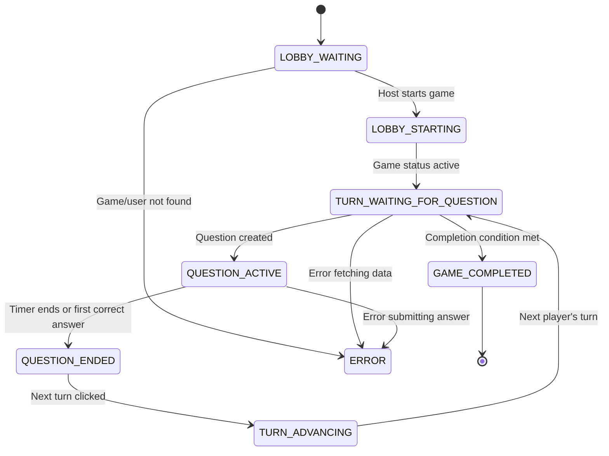

# Core Gameplay:

DevQuizBattle is a multiplayer, turn-based coding quiz game powered by AI. The following outlines the core gameplay and requirements:

### Game Flow

1. **Lobby/Game Creation**

   - Users can create new game rooms with customizable settings.
   - Each game room is assigned a unique code for others to join.
   - The creator is the host with admin privileges.
   - Players must join before the game starts.

2. **Game Joining**

   - Players join by entering a game code.
   - Players select a user_name and avatar before joining.
   - All active players are visible in a waiting area.
   - The host can start the game when ready.

3. **Turn-Based Gameplay**

   - Players take turns in a predetermined order.
   - On their turn, the current player selects:
     - Programming language (e.g., JavaScript, Python, Java, C#, etc.)
     - Difficulty level (Easy, Medium, Hard, Expert)
   - The AI generates a coding question based on these selections.
   - All players can attempt to answer simultaneously.

4. **Question Generation (AI)**

   - Use Groq LLM to generate questions tailored to the selected language and difficulty.
   - Each question includes:
     - A formatted code sample with syntax highlighting.
     - Four possible answers (one correct).
     - An explanation of the correct answer (shown after completion).

5. **Question Presentation and Answer Submission**

- Players are presented with a question and four possible answers.
- A timer starts as soon as the question is displayed.
- All players can submit their answers at any time during the timer.
- Ensure there are no race conditions in the Supabase database when multiple players submit answers simultaneously.

**Answer Validation:**

- Upon answer submission, immediately check if the answer is correct or incorrect.
- Once a player submits an answer, disable further submissions for that player for the current question.
- Display the answer status (correct/incorrect) to all players in real time.

**Incorrect Answer Handling:**

- If a player submits an incorrect answer, they cannot answer the same question again.
- Other players may continue submitting answers until someone answers correctly or the timer expires.

**Game Completion:**

- When a player submits the correct answer, or if the timer runs out with no correct answers, mark the question as completed.
- Pass the turn to the next player.

6. **Scoring System**

   - The first player to answer correctly receives 1 base point.
   - Time-based bonus points:
     - Under 15 seconds: +3 points
     - 15–30 seconds: +2 points
     - 30–60 seconds: +1 point
     - 60–120 seconds: +0.5 points
     - Over 120 seconds: no bonus
   - Correct answers are highlighted in green; incorrect in red.
   - No penalty for wrong answers.

7. **Real-time Updates**
   - All game state changes are broadcast instantly to all players using Supabase Realtime.
   - Players see who is answering, current scores, and elapsed time.
   - The leaderboard updates live as scores change.

Based on your detailed game flow and logic, here are the **possible states** of the game that you can use to design a reducer or a state machine. I’ll organize them by **major phases** and **substates** within those phases, including relevant flags and transitions.

---

## 1. Game Setup & Lobby Phase

### States:

- **LOBBY_WAITING**

  - Game status: `"waiting"`
  - Players are joining, waiting for minimum players.
  - Host can start the game if conditions met.
  - Players can leave or join.
  - Host presence: if host leaves → game ends.

- **LOBBY_STARTING** (optional intermediate state)

  - Host clicked "Start Game" → updating status to `"active"`
  - Could be a transient state while server updates.

- **ERROR / NOT_FOUND**
  - Game or user not found or unauthorized access.

---

## 2. Active Gameplay Phase

### States:

- **TURN_WAITING_FOR_QUESTION**

  - Game status: `"active"`
  - Current player’s turn to create/select a question.
  - No current question yet (`currentQuestion === null`).
  - Only current player can interact with question selection.

- **QUESTION_ACTIVE**

  - A question is displayed to all players.
  - Timer running.
  - Players can submit answers.
  - Answers are being collected in real-time.

- **QUESTION_ENDED**

  - Question ended (either by first correct answer or timer).
  - Winner determined or no winner.
  - Show turn result card with winner info.
  - Waiting for "Next Turn" action.

- **TURN_ADVANCING** (optional transient state)
  - After "Next Turn" clicked, updating current turn and resetting question state.

---

## 3. Game Completion Phase

### States:

- **GAME_COMPLETED**
  - Game status: `"completed"`
  - All players have created questions or other completion conditions met.
  - Show final scoreboard and results.

---

## 4. Player States (substates or flags related to players)

- **PLAYER_ACTIVE**

  - Player is currently active in the game.

- **PLAYER_INACTIVE**

  - Player has left or been marked inactive.

- **PLAYER_HOST**

  - Player is the host.

- **PLAYER_TURN**
  - It is this player’s turn.

---

## 5. Error & Loading States (cross-cutting)

- **LOADING**

  - Data fetching or server updates in progress.

- **ERROR**
  - Any error during fetching, submitting, or real-time updates.

---

# Summary of States for Reducer / State Machine

| State Name                  | Description                                                  |
| --------------------------- | ------------------------------------------------------------ |
| `LOBBY_WAITING`             | Waiting for players to join, host can start game.            |
| `LOBBY_STARTING`            | Host has started the game, transitioning to active gameplay. |
| `TURN_WAITING_FOR_QUESTION` | Current player selects/creates a question.                   |
| `QUESTION_ACTIVE`           | Question displayed, players answering, timer running.        |
| `QUESTION_ENDED`            | Question ended, winner shown, waiting for next turn.         |
| `TURN_ADVANCING`            | Transitioning to next turn, resetting question state.        |
| `GAME_COMPLETED`            | Game finished, show final results.                           |
| `ERROR`                     | Error state (game/user not found, network issues, etc).      |
| `LOADING`                   | Loading or waiting for server response.                      |

---

# Example State Machine Transitions

---

# Additional Notes for Implementation

- You can keep **player-specific flags** (isHost, isCurrentPlayerTurn, isNextPlayerTurn) as part of the state or derived from the main state.
- Use **substates or flags** for loading and error conditions to show UI feedback.
- Consider **timeouts and timers** as side effects triggered by entering `QUESTION_ACTIVE`.
- Real-time updates can trigger state transitions or data refreshes but don’t necessarily need separate states.

---

now what i want is based on this game flow and logic, to create state machine using xState v5 that can handle the game state transitions and actions.
consider that the game is a multiplayer game and the state machine should be able to handle multiple players and their actions, so we need to haddle supabase realtime updates and actions that can be performed by players.

- The state machine should be able to handle the game flow and logic as described above.

for now just create the state machine and the actions that can be performed by players, we will add the supabase integration later.
use the current supabase schema and don't change it.
use the current supabase functions defined in the supabase folder and don't change them.
